# GERAT SOFTWARE SOLUTIONS PLC // COMMAND & CMS DASHBOARD SPECIFICATION
> **Document Version:** 1.0.0  
> **Status:** Architectural Blueprint & Research Specification  
> **Codename:** `GERAT MISSION CONTROL` (`/dashboard`)  
> **Target Production URL:** [https://gerat.et/dashboard](https://gerat.et/dashboard)  
> **System Scope:** Integrated Client Relationship Management (CRM), Lead Intake Telemetry, Content Management System (CMS), Communications Pipeline, Team Management & Site Telemetry

---

## 1. Executive Summary & Vision

**Gerat Software Solutions PLC** operates at the intersection of deep-tech engineering, enterprise infrastructure, and elite visual identity (*"From Identity to Infrastructure"*). The public-facing website represents this high-density, dark architectural standard. 

To maintain this standard without requiring engineers to modify static source code for every article, case study, team update, or inquiry triage, Gerat requires a unified **Operations & Content Management Command Center** (`GERAT MISSION CONTROL`).

### Core Strategic Mandates:
1. **Zero Lead Leakage:** Inquiries arriving via the website's `ContactDrawer` and service landing pages must be captured in real-time, assigned an immutable telemetry code (`GRT-ENG-XXXXXX` / `GRT-BRD-XXXXXX`), triaged through a structured pipeline, and actionable via 1-click client communication channels (WhatsApp, direct phone, and templated email).
2. **Editorial Independence for the Entire Team:** Empower leadership, engineers, and creative directors to publish technical whitepapers, case studies, team roster updates, and service packages without touching raw JSX code.
3. **Internal Activity & Audit Trail:** Provide an internal conversation thread for each client lead—capturing call notes, proposal drafts, assigned architects, and qualification statuses.
4. **Cohesive Design Language:** The dashboard must not look like a generic Bootstrap or off-the-shelf template; it must continue Gerat's dark monolithic aesthetic (`#080808` obsidian canvas, `#141414` technical surfaces, `#FF4A00` precision accent, and Azeret Mono telemetry metrics).
5. **Architectural Extensibility:** Future-proofed to support client-facing shared project rooms, milestone tracking, quote/invoice generation, and automated lead scoring.

---

## 2. Industry Benchmark & Research Findings

A comprehensive comparative analysis of modern high-end software studios, engineering consultancies, and digital agencies revealed critical design patterns:

### 2.1 Studio & Agency Benchmark Analysis

| Studio / Platform | Model Type | Pros | Cons / Gaps for Gerat | Takeaway for Gerat |
| :--- | :--- | :--- | :--- | :--- |
| **Linear** | Engineering Issue & Project Cockpit | Keyboard-first (`⌘K`), sub-50ms UI response, high information density, clean dark mode. | Built for issue tracking, not client lead intake or CMS publishing. | Adopt Linear's keyboard-first design, high-density data grid, and minimalist status indicators. |
| **Sanity / Strapi / Contentful** | Headless CMS | Flexible content modeling, live previews, asset pipeline. | Disconnected from client inquiries; requires separate CRM; high SaaS subscription overhead. | Build a native Next.js dashboard colocated with the app router rather than third-party SaaS silos. |
| **Instrument / Work & Co / Metalab** | Bespoke Agency Command Center | Integrated intake, lead triage, client comms logging, and portfolio publishing in one unified internal portal. | Custom internal development effort required. | **The Gold Standard:** Combine CRM pipeline + CMS + Team Directory in a single Next.js route group `(dashboard)`. |
| **HubSpot / Salesforce** | Enterprise CRM | Deep sales workflows, automation rules. | Bloated, generic UI, high monthly cost, disconnects from site design and portfolio publishing. | Avoid. A streamlined, bespoke lightweight CRM tailored to Gerat's intake format delivers 10x faster workflow. |

### 2.2 Key Architectural Decisions from Research

1. **Native Next.js 16 App Router Colocation (`/src/app/(dashboard)/`):**
   - No separate frontend codebase or external domain needed.
   - Shared design tokens, TypeScript types, and server-side component rendering for near-instant navigation.
   - Direct database access via Server Actions and Next.js Route Handlers without cross-origin latency.
2. **PostgreSQL + Prisma ORM / Supabase:**
   - Relational data integrity for linked models (e.g., an `Inquiry` links to multiple `InquiryNotes`, `InquiryComms`, and assigned `User`).
   - JSONB support for flexible metadata (e.g., conditional creative answers from the `ContactDrawer`).
3. **Role-Based Access Control (RBAC):**
   - Different team members have focused views (e.g., Sales/Ops manages incoming leads; Engineers review whitepapers; Leadership has full oversight).

---

## 3. Core Functional Domains & Feature Matrix

The Gerat Dashboard is partitioned into **seven core operational domains**:

```mermaid
graph TD
    Dashboard["GERAT MISSION CONTROL (/dashboard)"]
    
    Dashboard --> CRM["01. CLIENT INTAKE & CRM"]
    Dashboard --> CMS_Insights["02. RESEARCH & INSIGHTS CMS"]
    Dashboard --> CMS_Portfolio["03. PORTFOLIO & PRODUCTS CMS"]
    Dashboard --> CMS_Team["04. TEAM & LEADERSHIP CMS"]
    Dashboard --> CMS_Services["05. SERVICES & CAPABILITIES"]
    Dashboard --> SiteConfig["06. SITE CONFIG & TELEMETRY"]
    Dashboard --> Security["07. RBAC & AUDIT LOGS"]

    CRM --> Pipeline["Kanban Pipeline & Data Grid"]
    CRM --> Comms["1-Click WhatsApp / Phone / Email"]
    CRM --> Notes["Internal Team Thread & Call Logs"]

    CMS_Insights --> Editor["Markdown / Rich Text Editor"]
    CMS_Insights --> Publishing["Draft / Review / Publish Workflow"]

    CMS_Portfolio --> CaseStudies["Case Study Specs & Metrics"]
    CMS_Portfolio --> Media["Deliverables & Media Gallery"]

    CMS_Team --> Roster["Leadership & Practitioners"]
    
    CMS_Services --> Pillars["Practice Pillars & Packages"]

    SiteConfig --> Marquee["Ticker Tokens & Brand Coordinates"]

    Security --> Roles["Super Admin / Tech Lead / Creative / Ops"]
    Security --> Audit["Immutable Mutation Trail"]
```



---

### Domain 01: Client Intake & Inquiry Management (CRM Pipeline)

Every submission from the website's `ContactDrawer` or dedicated service consultation forms routes directly into this module.

#### Features & Workflows:
1. **Telemetry Intake Tracking:**
   - Unique tracking code: `GRT-ENG-YYYYMM-XXXX` (Engineering/AI) or `GRT-BRD-YYYYMM-XXXX` (Brand/Creative).
   - Timestamp, referral source, client IP/country geolocation, and user-agent.
2. **Multi-View Lead Management:**
   - **Kanban Board View:** Columns for `NEW_INTAKE` (Unread), `TRIAGED` (Reviewing), `DISCOVERY_SCHEDULED`, `PROPOSAL_SENT`, `IN_NEGOTIATION`, `COMMISSIONED` (Won), and `ARCHIVED` / `DISQUALIFIED`.
   - **Data Grid / Table View:** High-density, sortable, filterable by discipline, budget tier, timeline, and status.
3. **Direct Client Action Bar:**
   - **1-Click WhatsApp:** Instant link formatted as `https://wa.me/{phone}?text={encoded_greeting}` containing the client's name and project reference.
   - **1-Click Phone Call:** `tel:{phone}` with automatic formatting.
   - **Integrated Email Composer:** Direct reply modal with pre-configured architectural response templates:
     - *Template A:* "Discovery Architecture Consultation Invite"
     - *Template B:* "Brand & Identity Scoping Questionnaire"
     - *Template C:* "Non-Disclosure Agreement (NDA) & Scope Review"
     - *Template D:* "Capacity & Timeline Clarification"
4. **Internal Lead Activity Thread:**
   - Private team discussion log attached to each lead.
   - Team members can write internal notes (e.g., *"Dawit reviewed: architecture requires Kafka cluster and HL7 parser"*).
   - Logged client phone calls with outcome summaries (e.g., *"Called founder; budget confirmed at 250k ETB; scheduling Zoom on Tuesday"*).
5. **Intake Qualification Flags:**
   - **Budget Tier:** `Under 25K ETB`, `25K - 75K ETB`, `75K - 150K ETB`, `150K - 250K ETB`, `250K+ ETB / Enterprise`.
   - **Delivery Timeline:** `URGENT (2-4 WEEKS)`, `STANDARD (1-3 MONTHS)`, `STRATEGIC (3-6+ MONTHS)`.
   - **Discipline Specialization:** Software Architecture, AI & RAG, Custom ERP, Public Sector, Brand Identity, Personal Branding.
   - **Conditional Context:** Brand stage (New Launch vs Rebrand), Vector guidelines existence, Executive role (Founder, VP, Consultant).

---

### Domain 02: Research & Insights CMS (Technical Whitepapers & News)

Allows the engineering and research teams to publish and maintain publications found on `/insights`.

#### Features & Workflows:
1. **Markdown / MDX & Rich Text Editor:**
   - Split-screen live preview supporting KaTeX math equations, code syntax highlighting, callout alert blocks (`NOTE`, `IMPORTANT`, `CAUTION`), and data tables.
2. **Metadata & Categorization:**
   - Title, URL Slug (auto-generated with manual override), Subtitle/Excerpt.
   - Category (`SYSTEM ARCHITECTURE`, `APPLIED AI & RAG`, `DISTRIBUTED SYSTEMS`, `BRAND ARCHITECTURE`).
   - Author association (linked to Team Member profile).
   - Reading time calculation (auto-computed from word count).
   - Publication date & Scheduled publishing.
3. **Lifecycle States:**
   - `DRAFT` → `IN_REVIEW` → `SCHEDULED` → `PUBLISHED` → `ARCHIVED`.
4. **SEO & Social OpenGraph Management:**
   - Meta title, meta description, social banner image upload, canonical URL preview.

---

### Domain 03: Flagship Portfolio & Product Showcase CMS

Empowers the team to manage the selected works displayed on `/portfolio` and the home page.

#### Features & Workflows:
1. **Case Study Entity Manager:**
   - Matches the structure of `portfolioProjects`:
     - Project Index & Numbering (`01 / 09`)
     - Title & Client Name
     - Category (`ENTERPRISE ERP`, `PUBLIC SECTOR`, `AI & RAG`, `BRAND & IDENTITY`, `PERSONAL BRAND`, `TELEMETRY`)
     - Headline Impact Metric (`45% CYCLE REDUCTION // 99.99% UPTIME`)
     - Full Impact Detail and Year of Delivery
     - Operational Problem / Challenge
     - Engineered / Creative Resolution
     - Technology Stack / Deliverables Tag Matrix
     - Primary Media Banner & Gallery Upload
     - Operational Status (`PRODUCTION // ACTIVE`, `DEPLOYED // STABLE`, `LIVE // EXPANDING`)
2. **Featured & Display Ordering:**
   - Drag-and-drop reordering for homepage feature cards and portfolio directory order.
3. **Deliverable Specifications:**
   - For engineering platforms: Architecture diagrams, GitHub link (if open-source), live demo URL.
   - For brand systems: Typefaces used, color palette swatches, vector file package download links.

---

### Domain 04: Team & Leadership Directory CMS

Manages the roster on `/team` and the leadership preview on `/`.

#### Features & Workflows:
1. **Profile Management:**
   - Full Name, Official Title / Role, Team Division (Executive Leadership vs Engineering Practitioners).
   - Focus Discipline & Tagline.
   - High-resolution headshot upload with automatic crop to 4:5 aspect ratio and grayscale filter toggle.
   - Architectural biography statement.
   - Core credentials (Degrees, certifications, notable projects).
   - External links (LinkedIn, GitHub, X/Twitter, Personal URL).
2. **Display Rank & Active State:**
   - Control display order and active/alumni status.

---

### Domain 05: Services, Practices & Capabilities Matrix

Maintains the 6 practice pillars on `/why-wqf`, the capabilities table on `/`, and the dedicated service pages (`/services/brand-creative` and `/services/personal-branding`).

#### Features & Workflows:
1. **Practice Pillar Editor:**
   - Pillar index (`01` - `06`), Title, Tagline, Editorial Description.
   - Deliverables bullet list.
   - Deep link destination.
2. **Capabilities Table Rows:**
   - 8-row capabilities matrix editor: Title, Index, Tags, Description.
3. **Service Packages & Pricing Matrix:**
   - Manage the 4 strategic packages (Scope, deliverables, timeline guidance, and starting investment).

---

### Domain 06: Global Site Configuration & Telemetry Controls

Central control panel for site-wide tokens and operational coordinates.

#### Features & Workflows:
1. **Marquee Ticker Tokens:**
   - Add, edit, or disable tokens in the continuous home page ticker.
2. **Partner & Technology Ecosystem Logos:**
   - Manage partner names, status, and SVGs displayed in the technology ecosystem grid.
3. **Company Telemetry & Contact Coordinates:**
   - Office physical address, GPS coordinates, public inquiry phone number, emergency hotline, and official email addresses.
4. **Emergency / Announcement Banner:**
   - Optional top-bar announcement banner with message, link, and active toggle.

---

### Domain 07: Security, RBAC & Immutable Audit Logs

Guarantees system safety, data integrity, and accountability.

#### Roles & Permissions (RBAC):
- **SUPER_ADMIN (Managing Director / Principal Architect):**
  - Full access to all modules, team user invitations, role changes, database exports, and site configuration.
- **OPERATIONS_LEAD (Client Operations & Business Development):**
  - Full access to CRM Inquiries, communication logging, client messaging, and lead pipeline.
  - Read-only access to CMS and Site Config.
- **TECHNICAL_EDITOR (Lead Software Architect):**
  - Full access to Research Insights CMS, Engineering Case Studies, and Tech Capabilities.
  - Read-only access to CRM Inquiries.
- **CREATIVE_EDITOR (Creative Director):**
  - Full access to Brand & Creative Case Studies, Creative Services, and Visual Assets.
- **VIEWER (Team Member):**
  - Read-only access to published content and team notes.

#### Immutable Audit Trail:
- Every insert, update, status change, and delete logs:
  - `actor_id` & `actor_email`
  - `action` (`CREATE`, `UPDATE`, `DELETE`, `STATUS_CHANGE`, `COMMUNICATION_SENT`)
  - `entity_type` (`INQUIRY`, `ARTICLE`, `PROJECT`, `TEAM_MEMBER`)
  - `entity_id`
  - `diff_payload` (JSON snapshot of changed fields)
  - `timestamp`

---

## 4. Database Schema Architecture (PostgreSQL / Prisma)

Below is the complete relational data model designed to support all dashboard domains:

```prisma
// datasource and generator
datasource db {
  provider = "postgresql"
  url      = env("DATABASE_URL")
}

generator client {
  provider = "prisma-client-js"
}

// -------------------------------------------------------------
// USER & AUTHENTICATION
// -------------------------------------------------------------

enum UserRole {
  SUPER_ADMIN
  OPERATIONS_LEAD
  TECHNICAL_EDITOR
  CREATIVE_EDITOR
  VIEWER
}

model User {
  id            String         @id @default(cuid())
  email         String         @unique
  name          String
  passwordHash  String
  role          UserRole       @default(VIEWER)
  avatarUrl     String?
  title         String?
  active        Boolean        @default(true)
  createdAt     DateTime       @default(now())
  updatedAt     DateTime       @updatedAt

  // Relations
  authoredArticles Article[]
  assignedInquiries Inquiry[]   @relation("AssignedArchitect")
  inquiryNotes     InquiryNote[]
  inquiryComms     InquiryCommunication[]
  auditLogs        AuditLog[]
}

// -------------------------------------------------------------
// CRM & INTAKE TELEMETRY
// -------------------------------------------------------------

enum InquiryStatus {
  NEW_INTAKE
  TRIAGED
  DISCOVERY_SCHEDULED
  PROPOSAL_SENT
  IN_NEGOTIATION
  COMMISSIONED
  DISQUALIFIED
  ARCHIVED
}

enum InquiryPriority {
  LOW
  MEDIUM
  HIGH
  CRITICAL_ENTERPRISE
}

model Inquiry {
  id              String          @id @default(cuid())
  telemetryCode   String          @unique // e.g. GRT-ENG-202609-847291
  status          InquiryStatus   @default(NEW_INTAKE)
  priority        InquiryPriority @default(MEDIUM)
  
  // Client Contact Details
  fullName        String
  email           String
  phone           String
  company         String?
  roleTitle       String?
  
  // Project Scope
  discipline      String          // e.g. Enterprise Architecture, Brand Identity
  subServices     String[]        // e.g. ["Logo Design", "Design Tokens"]
  timeline        String          // e.g. Standard (1-3 Months)
  budgetRange     String          // e.g. 75K - 150K ETB
  projectBrief    String          @db.Text
  
  // Dynamic Questionnaire Answers (JSONB)
  metadata        Json?           // Brand status, existing guidelines, executive needs
  
  // Telemetry Tracking
  sourceUrl       String?
  ipAddress       String?
  countryCode     String?
  userAgent       String?
  
  // Assignment & Dates
  assignedToId    String?
  assignedTo      User?           @relation("AssignedArchitect", fields: [assignedToId], references: [id])
  createdAt       DateTime        @default(now())
  updatedAt       DateTime        @updatedAt

  // Relations
  notes           InquiryNote[]
  communications  InquiryCommunication[]
}

model InquiryNote {
  id          String   @id @default(cuid())
  inquiryId   String
  inquiry     Inquiry  @relation(fields: [inquiryId], references: [id], onDelete: Cascade)
  authorId    String
  author      User     @relation(fields: [authorId], references: [id])
  content     String   @db.Text
  isPinned    Boolean  @default(false)
  createdAt   DateTime @default(now())
  updatedAt   DateTime @updatedAt
}

enum CommChannel {
  WHATSAPP
  PHONE_CALL
  EMAIL
  IN_PERSON_MEETING
  VIRTUAL_ZOOM
}

model InquiryCommunication {
  id          String      @id @default(cuid())
  inquiryId   String
  inquiry     Inquiry     @relation(fields: [inquiryId], references: [id], onDelete: Cascade)
  actorId     String
  actor       User        @relation(fields: [actorId], references: [id])
  channel     CommChannel
  subject     String?
  summary     String      @db.Text
  outcome     String?     // e.g. "Scheduled follow-up for Friday"
  loggedAt    DateTime    @default(now())
}

// -------------------------------------------------------------
// CMS: RESEARCH & INSIGHTS
// -------------------------------------------------------------

enum ArticleStatus {
  DRAFT
  IN_REVIEW
  SCHEDULED
  PUBLISHED
  ARCHIVED
}

model Article {
  id              String        @id @default(cuid())
  slug            String        @unique
  title           String
  subtitle        String?
  category        String        // e.g. SYSTEM ARCHITECTURE
  content         String        @db.Text // Markdown / MDX / Structured HTML
  excerpt         String?       @db.Text
  readingTime     String?       // e.g. "6 MIN READ"
  coverImageUrl   String?
  tags            String[]
  status          ArticleStatus @default(DRAFT)
  featured        Boolean       @default(false)
  
  authorId        String
  author          User          @relation(fields: [authorId], references: [id])
  
  publishedAt     DateTime?
  createdAt       DateTime      @default(now())
  updatedAt       DateTime      @updatedAt
}

// -------------------------------------------------------------
// CMS: PORTFOLIO & PRODUCTS
// -------------------------------------------------------------

model CaseStudy {
  id              String   @id @default(cuid())
  slug            String   @unique
  displayIndex    String   // "01", "02", etc.
  num             String   // "01 / 09"
  title           String
  category        String   // "ENTERPRISE ERP", "BRAND & IDENTITY", etc.
  tags            String   // Secondary discipline line
  metric          String   // e.g. "12M+ RECORDS // SUB-SECOND VERIFICATION"
  metricDetail    String?
  summary         String   @db.Text
  problem         String   @db.Text
  architecture    String   @db.Text
  techStack       String   // String list e.g. "GO // KAFKA // POSTGRES"
  stackBadges     String[] // Array e.g. ["Rust", "PostgreSQL", "Kafka"]
  imageUrl        String
  galleryImages   String[]
  impact          String   @db.Text
  year            String
  status          String   // "PRODUCTION // STABLE"
  featured        Boolean  @default(false)
  order           Int      @default(0)
  createdAt       DateTime @default(now())
  updatedAt       DateTime @updatedAt
}

// -------------------------------------------------------------
// CMS: TEAM & LEADERSHIP
// -------------------------------------------------------------

enum TeamDivision {
  EXECUTIVE_LEADERSHIP
  ENGINEERING_PRACTITIONER
  CREATIVE_DIRECTOR
  ADVISOR
}

model TeamMember {
  id          String       @id @default(cuid())
  name        String
  roleTitle   String
  division    TeamDivision @default(ENGINEERING_PRACTITIONER)
  focusTag    String       // e.g. "DISTRIBUTED SYSTEMS // CONSENSUS"
  bio         String       @db.Text
  photoUrl    String
  order       Int          @default(0)
  active      Boolean      @default(true)
  
  // Social links
  linkedinUrl String?
  githubUrl   String?
  twitterUrl  String?
  
  createdAt   DateTime     @default(now())
  updatedAt   DateTime     @updatedAt
}

// -------------------------------------------------------------
// CMS: SERVICES & PRACTICE PILLARS
// -------------------------------------------------------------

model ServicePillar {
  id           String   @id @default(cuid())
  num          String   // "01", "02", etc.
  title        String
  tagline      String
  desc         String   @db.Text
  deliverables String[]
  deepLink     String?
  order        Int      @default(0)
  active       Boolean  @default(true)
  createdAt    DateTime @default(now())
  updatedAt    DateTime @updatedAt
}

// -------------------------------------------------------------
// AUDIT LOG
// -------------------------------------------------------------

model AuditLog {
  id         String   @id @default(cuid())
  actorId    String
  actor      User     @relation(fields: [actorId], references: [id])
  action     String   // "CREATE", "UPDATE", "DELETE", "STATUS_CHANGE"
  entityType String   // "INQUIRY", "ARTICLE", "CASE_STUDY", etc.
  entityId   String
  diff       Json?    // Detailed field delta
  ipAddress  String?
  createdAt  DateTime @default(now())
}
```

---

## 5. UI / UX Design System for the Dashboard

The dashboard interface must uphold the same aesthetic rigor as the client-facing website, optimized for high data density and zero fatigue:

### 5.1 Design Tokens & Palettes
- **Canvas Base:** `#080808` (Obsidian terminal)
- **Panel / Card Surface:** `#121212` with `border-white/10` hairlines
- **Active / Accent Spark:** `#FF4A00` (Signal Orange for CTAs, active status, unread leads)
- **Typography:**
  - **Headings & Primary Metrics:** `Azeret Mono` (Uppercase, tracked `0.15em`)
  - **Body & Longform Content:** `Roc Grotesk` / Clean sans-serif for reading ease
- **Density:** Tight padding, compact table rows, micro-badges, sticky sidebar, command palette (`⌘K`).

### 5.2 Information Architecture & Route Map

```text
src/app/(dashboard)/
├── layout.jsx               --> Global Dashboard Shell (Sidebar + Top Bar + Command Palette)
├── page.jsx                 --> Executive Overview Cockpit (KPIs, Urgent Leads, Recent Publishes)
├── inquiries/
│   ├── page.jsx             --> Master CRM Pipeline (Kanban & Table Views)
│   └── [id]/page.jsx        --> Lead Deep-Dive (Client Dossier, WhatsApp/Call Bar, Notes Thread)
├── insights/
│   ├── page.jsx             --> Articles List & Status Filters
│   └── [id]/page.jsx        --> Split-Screen Markdown Editor & Metadata Inspector
├── portfolio/
│   ├── page.jsx             --> Flagship Works List & Reordering
│   └── [id]/page.jsx        --> Case Study Editor (Specs, Metrics, Tech Badges, Media)
├── team/
│   ├── page.jsx             --> Leadership & Practitioners Directory
│   └── [id]/page.jsx        --> Profile & Headshot Crop Editor
├── services/
│   └── page.jsx             --> Practice Pillars, Capabilities & Packages Editor
├── settings/
│   ├── page.jsx             --> Team Members, RBAC Roles & Invitations
│   ├── site-config/page.jsx --> Marquee Ticker Tokens & Contact Coordinates
│   └── audit-log/page.jsx   --> Immutable System Mutation Trail
└── login/
    └── page.jsx             --> Minimalist Zero-Distraction Auth Screen
```

---

## 6. Real-Time Client Communication Pipeline

The most critical operational feature is converting raw web inquiries into immediate client engagement:

```
┌────────────────────────────────────────────────────────────────────────┐
│                        CLIENT INTAKE PIPELINE                          │
├────────────────────────────────────────────────────────────────────────┤
│ 1. Client Submits ContactDrawer / Service Form                         │
│    └─→ Validated & telemetry code issued: GRT-ENG-202609-847291       │
│                                                                        │
│ 2. Real-Time Dispatch Engine:                                          │
│    ├─→ Saved to PostgreSQL DB with status: NEW_INTAKE                  │
│    ├─→ Instant Telegram / WhatsApp Bot Notification to Founders        │
│    └─→ Confirmation Email auto-sent to client with Intake Reference    │
│                                                                        │
│ 3. Team Action via Dashboard:                                          │
│    ├─→ 1-Click WhatsApp: Pre-populates formal greeting with Telemetry  │
│    ├─→ 1-Click Call: Direct dialing from mobile or softphone           │
│    ├─→ Email Composer: One-click send with proposal / NDA template     │
│    └─→ Internal Call Logging: Records outcome & updates stage          │
└────────────────────────────────────────────────────────────────────────┘
```

### WhatsApp 1-Click Protocol
When a team member clicks the WhatsApp icon on a lead, it generates:
```
https://wa.me/251911234567?text=Hello%20Abebe%2C%20this%20is%20Dawit%20from%20Gerat%20Software%20Solutions.%20We%20received%20your%20inquiry%20regarding%20Enterprise%20ERP%20Architecture%20(Ref%3A%20GRT-ENG-202609-847291).%20I%20would%20like%20to%20schedule%20a%20brief%20discovery%20call%20with%20our%20lead%20architect.
```

---

## 7. Future Extensibility & Enterprise Add-ons

The architecture is explicitly designed for seamless scaling:

1. **Client Portal / Shared Deal Rooms (`/portal/[token]`):**
   - Passwordless magic link for prospective clients to review their custom scope of work, technical architecture diagrams, fee estimates, and download vector assets securely.
2. **Automated Proposal & Quote PDF Generation:**
   - One-click export turning an inquiry into an official branded Gerat Software Solutions PLC proposal document.
3. **AI Lead Summarizer & Drafting Assistant:**
   - Local or domain-grounded LLM that analyzes long project briefs and drafts a preliminary architecture stack suggestion and discovery questionnaire for the team.
4. **Stripe / Chapa / Telebirr Payment Invoicing:**
   - Milestone billing integration for retainer and deposit collection.

---

## 8. Summary of Benefits

- **Speed:** Less than 5-minute response time to high-value enterprise leads via instant phone/WhatsApp shortcuts.
- **Independence:** Zero engineering time wasted manually editing hardcoded text or JSON files for blog posts, case studies, or team photos.
- **Security:** Complete visibility into team actions, role restrictions, and audit trails.
- **Brand Consistency:** High-density, professional command center matching Gerat's world-class architectural caliber.
