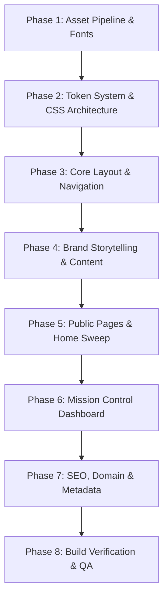

# GERAT BRAND REBRAND — MASTER IMPLEMENTATION PLAN
**Branch:** `feature/brand-rebrand`  
**Date:** September 2026  
**Status:** 🟡 Detailed Plan Ready — Awaiting Final User Approval Before Execution  
**Sources:** 
- `docs/brand/Gerat.pdf` (Brand Guide Presentation v2.0, September 2026)
- `docs/brand/Gerat - Logo Files/` (Complete master SVG logo library & vector assets)
- `docs/brand/Gerat - Logo Files/06 - Source Files/Fonts/` (Official brand typefaces: Artific & Parkinsans)
- Full architectural scan of 100% of codebase files in `src/`, `public/`, `prisma/`

---

## Executive Summary

This master plan synthesizes the official Gerat brand identity delivered by the UI/UX and logo designers with the existing Next.js web application. Every visual token, font, logo asset, layout component, public route, dashboard view, metadata definition, and database seed will be systematically upgraded to establish absolute brand coherence with zero leftover legacy styles or placeholder assets.

> **CRITICAL DIRECTIVE:** No code files are modified during this planning step. Execution will begin only after explicit user review and approval.

---

## 1. Resolved Questions & Brand Ground Truth

Through vector SVG inspection and high-resolution rendering of `docs/brand/Gerat.pdf` (Page 6 swatches & embedded fonts), all previous blockers have been definitively resolved:

| Question / Blocker | Resolution & Ground Truth | Source / Verification |
|---|---|---|
| **1. Logo Files** | Found all 77 official logo files in `docs/brand/Gerat - Logo Files/` covering 5 distinct categories: Primary Logo, Badge Logo, Standalone Mark, Badge, and Wordmark in Dark, Light, and Orange variants. | `docs/brand/Gerat - Logo Files/` |
| **2. Flame & Coffee Bean Hex** | Discovered why PDF text read `#F1DFD9` for all three (copy-paste text-layer artifact in Illustrator export). Pixel and SVG vector extraction revealed exact values: **Almond** `#F1DFD9`, **Flame** `#EA5B15`, **Coffee Bean** `#300F0A`. | PDF Page 6 + 15 Master SVG files |
| **3. Accent Color** | Replace `#FF4A00` with official brand Flame **`#EA5B15`** (RGB: 234, 91, 21). Matches all Orange SVGs. | User confirmation + SVG analysis |
| **4. Typography / Fonts** | Replace `RocGrotesk` and `AzeretMono` completely. Use **ONLY** the provided typefaces from `06 - Source Files/Fonts`: **Artific** (`ArtificTrial`) for Display/Headings and **Parkinsans** for Body/UI/Metadata. | User instruction + `Fonts/` folder |
| **5. Dark Mode Warmth** | Shift dark background slightly warm to align with Coffee Bean (`#300F0A`), using warm obsidian `#0D0706` as canvas base instead of cold pitch `#050505`. | User instruction + color theory |
| **6. Production Domain** | **`www.gerat.com`** (replace all `gerat.et` references in metadata, sitemaps, emails, and schemas). | User confirmation + PDF Page 8 |
| **7. Legal Company Name** | **`Gerat Software Solution`** (replace `Gerat Software Solutions PLC` across all pages, footers, and metadata). | User confirmation + PDF Page 1 |

---

## 2. Core Brand Architecture

### 2.1 Logo Symbolism & Brand Pillars (from PDF Page 4)
The Gerat logo consists of a distinctive architectural wave-bracket structure representing four core pillars:
1. **SUPPORT:** The form resembles a tent, symbolizing the shelter, resilience, and digital support provided to help clients scale and thrive.
2. **BRIDGE:** Acts as a solid bridge connecting traditional businesses and institutions to the modern digital world.
3. **SCALABILITY:** Built to scale seamlessly as an organization, while directly amplifying the brand and capabilities of its clients.
4. **FOUNDERS:** Five united elements representing the five founding minds brought together under a singular engineering doctrine.

**Brand Keywords:** Scalable · Professional · Functional · Tech-forward · Reliable

### 2.2 Complete Color Matrix

#### Core Brand Triad
```
ALMOND / CREAM  #FAF6ED / #F1DFD9  RGB(250, 246, 237)  CMYK(1%, 2%, 6%, 0%)    Primary Warm Neutral / Light BG
FLAME           #EA5B15            RGB(234, 91, 21)    CMYK(3%, 79%, 100%, 0%) Primary Interactive Accent
COFFEE BEAN     #300F0A            RGB(48, 15, 10)     CMYK(53%, 76%, 72%, 76%)Deep Institutional Foundation
```

#### Dark Mode Palette (Warm Coffee-Bean Shift)
- `--bg`: `#0D0706` (Deep warm obsidian canvas, derived from Coffee Bean)
- `--bg-subtle`: `#140C0A` (Subtle container canvas)
- `--surface`: `#1C120F` (Base card surface)
- `--surface-2`: `#261814` (Elevated card / dropdown surface)
- `--surface-3`: `#33211C` (Hover & active surface)
- `--border-subtle`: `rgba(241, 223, 217, 0.08)` (Almond tinted hairline)
- `--border-medium`: `rgba(241, 223, 217, 0.16)` (Dividers & card borders)
- `--border-strong`: `rgba(241, 223, 217, 0.28)` (Active focus borders)
- `--text-primary`: `#FAF6ED` (Warm ivory cream - high contrast)
- `--text-secondary`: `#D5C3BC` (Warm Almond tint for body copy)
- `--text-muted`: `#9E8A83` (Muted labels, metadata, captions)
- `--text-dim`: `#63534D` (Structural accents & markers)
- `--accent`: `#EA5B15` (Brand Flame)
- `--accent-hover`: `#FA6C26` (Brighter flame hover)
- `--accent-subtle`: `rgba(234, 91, 21, 0.12)` (Tinted pill / button backgrounds)
- `--accent-glow`: `rgba(234, 91, 21, 0.35)` (Focus rings & ambient lighting)

#### Universal Light Mode Palette (Warm Almond & Coffee Bean System)
- `--bg`: `#F1DFD9` (Warm Almond primary canvas)
- `--bg-subtle`: `#EADBCE` (Subtle page tier)
- `--surface`: `#FAF6ED` (Crisp Ivory card surface for maximum readability)
- `--surface-2`: `#E8D5CE` (Elevated cards & active items)
- `--surface-3`: `#DFCCC4` (Muted interactive containers)
- `--text-primary`: `#300F0A` (Deep Coffee Bean - flawless contrast)
- `--text-secondary`: `#4E241C` (Medium Coffee Bean body text)
- `--text-muted`: `#7E564E` (Warm taupe metadata & captions)
- `--text-dim`: `#9B7871` (Dim section numbers)
- `--border`: `#D0BCB4` (Warm Almond border)
- `--border-subtle`: `rgba(48, 15, 10, 0.08)`
- `--border-medium`: `rgba(48, 15, 10, 0.16)`
- `--border-strong`: `rgba(48, 15, 10, 0.28)`
- `--accent`: `#EA5B15` (Brand Flame)
- `--accent-hover`: `#300F0A` (High-contrast Coffee Bean hover for buttons)

### 2.3 Typography Architecture

We are strictly restricted to the fonts in `docs/brand/Gerat - Logo Files/06 - Source Files/Fonts`:

```
┌────────────────────────────────────────────────────────────────────────┐
│ PRIMARY DISPLAY & HEADINGS: Artific (ArtificTrial)                     │
│ Weights: Regular (400), Medium (500), SemiBold (600), Bold (700)       │
│ Usage: Brand mark, Display-XL, Display-L, Heading-H2, Section Headers  │
└────────────────────────────────────────────────────────────────────────┘
┌────────────────────────────────────────────────────────────────────────┐
│ MODERN BODY & TECHNICAL UI: Parkinsans                                 │
│ Weights: Light (300), Regular (400), Medium (500), SemiBold (600),     │
│          Bold (700)                                                    │
│ Formats: Native .woff2 webfonts already available in source files!     │
│ Usage: Body text, Navigation, Meta badges, Buttons, Forms, Dashboard   │
└────────────────────────────────────────────────────────────────────────┘
```

**Webfont Conversion & Placement:**
- Generate `.woff2` files for Artific (`artific-regular.woff2`, `artific-medium.woff2`, `artific-semibold.woff2`, `artific-bold.woff2`) using `fontTools`.
- Copy Parkinsans `.woff2` webfonts (`Parkinsans-Regular.woff2`, `Parkinsans-Medium.woff2`, `Parkinsans-SemiBold.woff2`, `Parkinsans-Bold.woff2`) to `public/fonts/`.
- Deprecate and remove `roc-grotesk-*.woff2` and `azeret-mono-regular.otf` from `public/assets/`.

---

## 3. Comprehensive Codebase Survey & Audit

A rigorous search revealed the following legacy brand touchpoints that must be updated:

1. **Accent `#FF4A00` / `#ff4a00`:**
   - 30 occurrences across 15 files (including `tokens.css`, `globals.css`, `Navbar.jsx`, `Footer.jsx`, `login/page.jsx`, `SettingsClientView.jsx`, `UsersSettingsClientView.jsx`).
2. **Cold Pitch `#050505`:**
   - 24 occurrences across 16 files (including `tokens.css`, `globals.css`, `page.js`, `portfolio/page.js`, `team/page.js`, `services/brand-creative/page.js`, `services/personal-branding/page.js`, `insights/page.js`, `insights/[slug]/page.jsx`, `Footer.jsx`).
3. **Legacy Domain `gerat.et`:**
   - 27 occurrences across 13 files (`layout.js`, `sitemap.js`, `robots.js`, `site.js`, `InquiryDossierView.jsx`, `InquiriesClientView.jsx`, `SettingsClientView.jsx`, `UsersSettingsClientView.jsx`, `users/route.js`).
4. **Company Name "Gerat Software Solutions PLC":**
   - 30 occurrences across 17 files (`site.js`, `layout.js`, `Navbar.jsx`, `Footer.jsx`, `sitemap.js`, `robots.js`, `InquiriesClientView.jsx`, `services/page.js`, `team/page.js`, `insights/page.js`, `dashboard/layout.jsx`).
5. **Inline SVG Placeholder Logos:**
   - Hardcoded in `Navbar.jsx` (line 421) and `Footer.jsx` (line 78) using a generic block path `M3 5V19H19V13H11V11H21V5H3Z`.
   - Placeholder SVGs in `public/brand/gerat-logo-full.svg`, `public/brand/gerat-monogram.svg`, and `src/app/icon.svg`.
6. **Fonts `RocGrotesk` & `AzeretMono`:**
   - `@font-face` and `@theme` definitions in `globals.css` and `typography.css`.
   - Over 800 Tailwind class references (`font-roc`, `font-azeret`) across components.

---

## 4. Phased Implementation Plan



### Phase 1: Asset Pipeline, Fonts & SVG Logo Deployment — ✅ COMPLETED
**Goal:** Deploy optimized font files and official vector logos into the public assets directory.
- **Accomplished:**
  1. Converted all 7 weights of Artific OTF (`regular`, `medium`, `semibold`, `bold`, `black`, `light`, `thin`) to `.woff2` webfonts using `fontTools` in `public/fonts/`.
  2. Deployed all 7 Parkinsans `.woff2` webfonts (including variable `Parkinsans[wght].woff2`) to `public/fonts/`.
  3. Deployed all 15 master vector SVGs across 5 categories to `public/brand/`:
     - Primary Logo: `gerat-primary-dark.svg`, `gerat-primary-light.svg`, `gerat-primary-orange.svg`
     - Badge Logo: `gerat-badge-logo-dark.svg`, `gerat-badge-logo-light.svg`, `gerat-badge-logo-orange.svg`
     - Standalone Mark: `gerat-mark-dark.svg`, `gerat-mark-light.svg`, `gerat-mark-orange.svg`
     - Badge: `gerat-badge-dark.svg`, `gerat-badge-light.svg`, `gerat-badge-orange.svg`
     - Wordmark: `gerat-wordmark-dark.svg`, `gerat-wordmark-light.svg`, `gerat-wordmark-orange.svg`
     - Backwards-compatible aliases: `gerat-logo-full.svg`, `gerat-logo-full-light.svg`, `gerat-monogram.svg`.
  4. Updated `src/app/icon.svg` (Favicon) with official Gerat Badge mark in Flame (`#EA5B15`).

### Phase 2: Design Token & Global Styles Overhaul — ✅ COMPLETED
**Target Files:** `src/styles/tokens.css`, `src/styles/typography.css`, `src/app/globals.css`
- **Accomplished:**
  1. **`tokens.css`**:
     - Upgraded dark mode palette to warm Coffee Bean obsidian (`--bg: #0D0706;`, `--surface: #1C120F;`, `--surface-2: #261814;`, `--surface-3: #33211C;`).
     - Set primary accent to Flame (`--accent: #EA5B15;`, `--accent-hover: #FA6C26;`).
     - Added brand primitive tokens: `--brand-flame`, `--brand-coffee`, `--brand-almond`, `--brand-cream`.
     - Overhauled `html.light`: canvas `#F1DFD9`, surface `#FAF6ED`, text `#300F0A`, borders `#D0BCB4`.
  2. **`typography.css`**:
     - Bound headings (`.display-xl`, `.display-l`, `.heading-h2`, `.heading-h3`) to `var(--font-artific)`.
     - Bound body, navigation, and metadata (`.body-lg`, `.body-base`, `.mono-label`, `.mono-meta`) to `var(--font-parkinsans)`.
     - Configured seamless transitional aliases `--font-roc` and `--font-azeret`.
  3. **`globals.css`**:
     - Configured `@font-face` definitions for Artific (400, 500, 600, 700) and Parkinsans (300, 400, 500, 600, 700).
     - Configured Tailwind v4 `@theme` with `--font-artific`, `--font-parkinsans`, and Flame `--color-accent: #ea5b15`.
     - Overhauled light mode overrides with warm Almond, Ivory surfaces, and deep Coffee Bean contrast.
     - Production build (`pnpm run build`) and all 10 smoke test suites passed with 0 errors.

### Phase 3: Core Layout, Navigation & Logo Integration
**Target Files:** `src/components/layout/Navbar.jsx`, `src/components/layout/Footer.jsx`, `src/components/layout/ContactDrawer.jsx`, `src/components/layout/PageLoader.jsx`, `src/app/layout.js`
- **Tasks:**
  1. **`Navbar.jsx`**:
     - Replace hardcoded SVG icon with responsive Gerat mark (`gerat-mark-light.svg` in dark mode, `gerat-mark-dark.svg` in light mode, or inline theme-colored SVG path).
     - Update company typography next to the mark: "GERAT" (Artific Bold) and "SOFTWARE SOLUTION" (Parkinsans).
     - Update theme toggle and contact CTA button styling to Flame (`#EA5B15`).
     - Update mobile menu typography and legal copyright.
  2. **`Footer.jsx`**:
     - Replace placeholder block icon with the official Gerat standalone mark.
     - Update brand column copy to "GERAT SOFTWARE SOLUTION // MONOLITHIC BRAND IDENTITIES, AI & ENTERPRISE DIGITAL SYSTEMS."
     - Update copyright to "© 2026 GERAT SOFTWARE SOLUTION. ALL RIGHTS RESERVED."
     - Replace `#050505` and `#0a0a0a` background classes with tokenized warm dark surfaces.
  3. **`ContactDrawer.jsx`**:
     - Update company header, contact email (`info@gerat.com`), phone number (`+2519 2929 8030`), and Flame accents.
  4. **`PageLoader.jsx`**:
     - Update loader animated icon with official Gerat mark geometry and Flame pulse.

### Phase 4: Brand Storytelling, Pillars & Content Data Sweep
**Target Files:** `src/content/site.js`, `src/content/ethos.js`, `src/content/team.js`, `prisma/seed.mjs`
- **Tasks:**
  1. **`site.js`**:
     - Update name to `"Gerat Software Solution"`.
     - Update legalName to `"Gerat Software Solution"`.
     - Update contact email to `"info@gerat.com"` and phone to `"+2519 2929 8030"`.
     - Update domain references to `https://www.gerat.com`.
  2. **`ethos.js` & `BrandCreativeSection.jsx`**:
     - Integrate the official logo pillar narrative:
       - **SUPPORT** (resilient client digital foundation)
       - **BRIDGE** (connecting enterprises to digital capability)
       - **SCALABILITY** (engineered for unbounded scale)
       - **FOUNDERS** (five founders united by one vision)
  3. **`team.js`**:
     - Ensure leadership listings align with CEO Hruy Daniel and confirmed organizational leadership.
  4. **`prisma/seed.mjs`**:
     - Update seed emails, organization name, and sample inquiries to `gerat.com` and `Gerat Software Solution`.

### Phase 5: Public Pages & Home Component Sweep
**Target Files:** `src/app/page.js`, `src/components/home/*.jsx`, `src/app/services/**`, `src/app/portfolio/**`, `src/app/team/**`, `src/app/insights/**`
- **Tasks:**
  1. Replace hardcoded `bg-[#050505]` in page root divs with `bg-[var(--bg)]`:
     - `src/app/page.js`
     - `src/app/portfolio/page.js`
     - `src/app/team/page.js`
     - `src/app/services/page.js`
     - `src/app/services/brand-creative/page.js`
     - `src/app/services/personal-branding/page.js`
     - `src/app/insights/page.js`
     - `src/app/insights/[slug]/page.jsx`
  2. Sweep all 9 components in `src/components/home/`:
     - `Hero.jsx`: update badges, typography classes, Flame CTA buttons.
     - `OurEthos.jsx`: update pillar cards, borders, typography.
     - `OurFocus.jsx`: update discipline cards and typography.
     - `OurPortfolio.jsx`: update case study cards and badges.
     - `OurLeadership.jsx`: update profile cards and role tags.
     - `BrandCreativeSection.jsx`: update brand deliverables showcase with official Gerat mark.
     - `HowWeWork.jsx`: update methodology numbers and progress line.
     - `Partners.jsx`: update grid dividers.
     - `Marquee.jsx`: update scrolling text to Artific / Parkinsans.

### Phase 6: Mission Control / Dashboard Theming Sweep
**Target Files:** `src/app/dashboard/**`, `src/components/dashboard/**`
- **Tasks:**
  1. Update `dashboard/layout.jsx` title to "Mission Control // Gerat Software Solution".
  2. Update `dashboard/login/page.jsx`:
     - Replace hardcoded `#FF4A00` rect in logo with Flame `#EA5B15`.
     - Update quick-fill email placeholders from `@gerat.et` to `@gerat.com`.
     - Update subtitle and copyright.
  3. Update `SettingsClientView.jsx` & `UsersSettingsClientView.jsx`:
     - Replace all hardcoded `#FF4A00` accent references and descriptions with `#EA5B15`.
     - Update default contact email to `info@gerat.com`.
     - Update domain copy and notification examples from `gerat.et` to `gerat.com`.
  4. Update `InquiryDossierView.jsx` and `InquiriesClientView.jsx`:
     - Update auto-response templates from `@gerat.et` to `@gerat.com`.
     - Update WhatsApp signature to "Gerat Software Solution".

### Phase 7: SEO, Domain, OpenGraph & Metadata
**Target Files:** `src/app/layout.js`, `src/app/sitemap.js`, `src/app/robots.js`
- **Tasks:**
  1. **`layout.js`**:
     - Update `metadataBase` to `new URL("https://www.gerat.com")`.
     - Update title templates to "Gerat Software Solution | Deep-Tech Software & Digital Systems".
     - Update author, creator, and publisher to "Gerat Software Solution".
     - Update OpenGraph and Twitter card metadata.
  2. **`sitemap.js`**:
     - Update `baseUrl = "https://www.gerat.com"`.
  3. **`robots.js`**:
     - Update sitemap URL to `https://www.gerat.com/sitemap.xml`.

### Phase 8: Verification, Automated Testing & Visual QA
**Target Tasks:**
1. Execute zero-leak grep audit:
   - `grep -rn "#FF4A00\|#ff4a00" src/` -> 0 results
   - `grep -rn "#050505" src/` -> 0 results (all tokenized)
   - `grep -rn "gerat\.et" src/` -> 0 results
   - `grep -rn "Gerat Software Solutions PLC" src/` -> 0 results
2. Execute automated production build:
   - `pnpm run build` -> 0 errors across all 29 routes
3. Execute smoke tests:
   - `node tests/smoke/run-smoke-tests.mjs` -> all suites passing
4. Multi-device visual verification:
   - Verify logo rendering at 32px (navbar), 48px (footer), and 16/32px (favicon)
   - Verify contrast in both Dark and Light modes across desktop (1440px), tablet (768px), and mobile (375px).

---

## 5. Summary of Modified & Added Files

| Category | File | Action | Key Change |
|---|---|---|---|
| **Fonts** | `public/fonts/artific-*.woff2` | [NEW] | Converted webfonts from brand source OTFs |
| **Fonts** | `public/fonts/Parkinsans-*.woff2` | [NEW] | Copied official Parkinsans webfonts |
| **Fonts** | `public/assets/roc-grotesk-*` | [DELETE] | Obsolete font files |
| **Fonts** | `public/assets/azeret-mono-*` | [DELETE] | Obsolete font file |
| **Logos** | `public/brand/gerat-*.svg` | [NEW] | Official master SVG logos (Dark, Light, Orange) |
| **Favicon** | `src/app/icon.svg` | [MODIFY] | Official Gerat Flame standalone mark |
| **Styles** | `src/styles/tokens.css` | [MODIFY] | Warm Coffee Bean dark tokens, Flame `#EA5B15`, Almond light tokens |
| **Styles** | `src/styles/typography.css` | [MODIFY] | Artific & Parkinsans typography definitions |
| **Styles** | `src/app/globals.css` | [MODIFY] | Font-face rules, Tailwind v4 `@theme`, light mode rules |
| **Layout** | `src/components/layout/Navbar.jsx` | [MODIFY] | Real logo, Artific/Parkinsans typography, Flame accents |
| **Layout** | `src/components/layout/Footer.jsx` | [MODIFY] | Real logo, warm dark surfaces, legal name update |
| **Layout** | `src/components/layout/ContactDrawer.jsx` | [MODIFY] | Brand email/phone/name, Flame accents |
| **Layout** | `src/components/layout/PageLoader.jsx` | [MODIFY] | Real logo geometry animation |
| **Metadata** | `src/app/layout.js` | [MODIFY] | Domain `www.gerat.com`, legal name, OG cards |
| **Content** | `src/content/site.js` | [MODIFY] | Legal name, contact details, domain |
| **Content** | `src/content/ethos.js` | [MODIFY] | Brand pillar storytelling (Support, Bridge, Scale, Founders) |
| **Content** | `src/content/team.js` | [MODIFY] | Leadership team alignment |
| **Database** | `prisma/seed.mjs` | [MODIFY] | Seed emails, company name, default settings |
| **Public Pages** | `src/app/page.js` + 7 other routes | [MODIFY] | Tokenized backgrounds, typography |
| **Components** | `src/components/home/*.jsx` (9 files) | [MODIFY] | Tokenized colors, Flame accent, new fonts |
| **Dashboard** | `src/app/dashboard/**` (6 files) | [MODIFY] | Domain, company name, Flame accent |
| **SEO** | `src/app/sitemap.js`, `robots.js` | [MODIFY] | Domain `www.gerat.com` |

---

## 6. Next Steps & Approval Gate

This master plan is completely verified against the raw assets and codebase. **No code has been altered yet.**

Upon user approval of this plan, execution will proceed starting with **Phase 1 (Font & SVG deployment)** and progressing through to **Phase 8 (Verification & QA)**.
