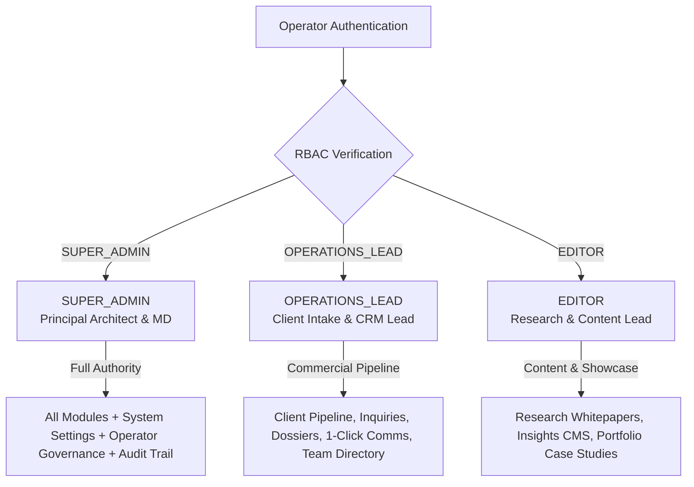

# GERAT MISSION CONTROL // ROLES & PERMISSIONS SPECIFICATION
> **Document Version:** 2.1.0  
> **Status:** Production Architecture Specification  
> **Location:** `progress/roles/ROLES_AND_PERMISSIONS.md` (and mirrored in `docs/progress/roles/ROLES_AND_PERMISSIONS.md`)  
> **Scope:** Consolidated 3-Role Access Control (RBAC), Page Restrictions, Navigation Filtering, API Guards & Task Division for Gerat Software Solutions PLC

---

## 1. Executive Summary & Role Consolidation

To ensure maximum operational efficiency, clear accountability, and streamlined security governance, Gerat Mission Control consolidates all studio operations into **three distinct roles**:

1. **`SUPER_ADMIN`**: Full root authority across all dashboard modules, operator user governance, site configuration, telemetry, and system audit logs.
2. **`OPERATIONS_LEAD`**: Commercial operations lead for client intake CRM, high-velocity lead triage, client communications (WhatsApp / Email / Calls), proposal scoping, and team directory assignments.
3. **`EDITOR`**: Exclusively dedicated to content creation, research publications, insights whitepapers, and portfolio case studies. All unrelated modules (CRM, Team, Services, Settings) are pruned from their view to provide a focused editorial environment without access errors.

---

## 2. Detailed Role Specifications

### Role 01: `SUPER_ADMIN`
- **Designation:** Principal Architect / Managing Director (Executive Leadership)
- **Standard Seed Account:** `admin@gerat.et`
- **Primary Mission:** Omnipotent studio oversight across executive operations, technical integrity, brand reputation, commercial growth, operator provisioning, and system infrastructure.
- **Core Responsibilities:**
  - Full visibility and mutation authority across all client leads, budgets, commercial agreements, and negotiation stages.
  - Authoring, publishing, and archiving technical research whitepapers and flagship case studies.
  - Managing team roster, practitioner bios, practice pillars, and capabilities matrices.
  - Managing operator accounts (creating operators, multi-channel credential dispatch via WhatsApp/Email/SMS, reassigning roles, resetting passwords, and deactivating accounts).
  - Configuring global studio telemetry, notification webhooks (Telegram/Slack), ticker tokens, and inspecting the immutable audit log.
- **Access Level:** **UNRESTRICTED (All Pages & APIs)**

---

### Role 02: `OPERATIONS_LEAD`
- **Designation:** Client Operations Lead / Business Development Manager
- **Standard Seed Account:** `operations@gerat.et`
- **Primary Mission:** High-velocity lead triage, commercial qualification, client communications, proposal dispatch, and contract closure.
- **Core Responsibilities:**
  - Triaging incoming website inquiries (`NEW_INTAKE`).
  - Engaging prospective clients via 1-click WhatsApp direct, phone calls, and templated architectural emails.
  - Qualifying client budgets (`75K - 150K ETB`, `250K+ ETB Enterprise`) and delivery timelines (`URGENT 2-4 WEEKS`).
  - Logging internal client call notes, meeting summaries, and communication touchpoints.
  - Advancing lead stages (`TRIAGED` → `DISCOVERY_SCHEDULED` → `PROPOSAL_SENT` → `IN_NEGOTIATION` → `COMMISSIONED`).
  - Referencing team practitioner profiles to assign appropriate technical leads.
  - Referencing practice pillars to scope proposal deliverables.
- **Allowed Pages:**
  - `/dashboard` (Operations Cockpit: Lead Velocity, Inquiries Awaiting Triage, Urgent Inquiries)
  - `/dashboard/inquiries` (Full Kanban & High-Density Data Grid)
  - `/dashboard/inquiries/[id]` (Lead Dossier, Email Composer, Communication Touchpoints, Notes)
  - `/dashboard/team` (Team Directory Reference for client project assignment)
  - `/dashboard/services` (Practice Pillars Reference for proposal deliverable scoping)
- **Strictly Restricted Pages:**
  - ❌ `/dashboard/settings/*` (No access to operator user management, webhooks, API tokens, GPS coordinates, or audit logs)
  - ❌ `/dashboard/insights/*` (Cannot access or edit research whitepapers)
  - ❌ `/dashboard/portfolio/*` (Cannot access or edit case studies)
  - ❌ `/dashboard/team/new` & `/[id]` (Cannot create or mutate team practitioner records)
  - ❌ `/dashboard/services/new` & `/[id]` (Cannot create or mutate service pillars)

---

### Role 03: `EDITOR`
- **Designation:** Content Editor / Research Architect / Technical Writer
- **Standard Seed Account:** `editor@gerat.et`
- **Primary Mission:** Authoring, curating, and publishing Gerat's intellectual property—deep-tech whitepapers, distributed systems architecture case studies, and engineering retrospectives.
- **Core Responsibilities:**
  - Authoring research articles with split-screen Markdown, math formulas (KaTeX), code syntax, and cover imagery (`/dashboard/insights/new`, `/dashboard/insights/[id]`).
  - Reviewing, updating, and transitioning publication statuses (`DRAFT` → `IN_REVIEW` → `PUBLISHED`).
  - Documenting enterprise case study technical specifications, architecture diagrams, latency metrics, and tech stack tags (`/dashboard/portfolio/new`, `/dashboard/portfolio/[id]`).
  - Self-service password management via the user profile menu.
- **Allowed Pages:**
  - `/dashboard` (Editorial Cockpit: Total Publications, Published Articles, Drafts in Progress, Portfolio Showcases)
  - `/dashboard/insights` + `/dashboard/insights/new` + `/dashboard/insights/[id]` (Full Research Articles CMS)
  - `/dashboard/portfolio` + `/dashboard/portfolio/new` + `/dashboard/portfolio/[id]` (Full Portfolio Case Studies CMS)
- **Strictly Restricted Pages (Pruned from UI & Blocked by Middleware):**
  - ❌ `/dashboard/inquiries/*` (Cannot access commercial client leads, phone numbers, budgets, or negotiations)
  - ❌ `/dashboard/team/*` (Cannot access team member roster management)
  - ❌ `/dashboard/services/*` (Cannot access practice pillars administration)
  - ❌ `/dashboard/settings/*` (Cannot access operator management, system webhooks, or mutation audit logs)

---

## 3. Comprehensive Page Access Matrix

| Dashboard Route | `SUPER_ADMIN` | `OPERATIONS_LEAD` | `EDITOR` |
| :--- | :---: | :---: | :---: |
| **`/dashboard` (Cockpit Overview)** | Executive Cockpit | Operations Cockpit | Editorial Cockpit |
| **`/dashboard/inquiries` (CRM Grid & Kanban)** | Full Access | Full Access | ⛔ BLOCKED (Pruned) |
| **`/dashboard/inquiries/[id]` (Lead Dossier & Comms)**| Full Access | Full Access | ⛔ BLOCKED (Pruned) |
| **`/dashboard/insights` (Articles List)** | Full Access | ⛔ BLOCKED (Pruned) | Full Access |
| **`/dashboard/insights/new` & `[id]` (Article CMS)** | Full Access | ⛔ BLOCKED (Pruned) | Full Access |
| **`/dashboard/portfolio` (Case Studies List)** | Full Access | ⛔ BLOCKED (Pruned) | Full Access |
| **`/dashboard/portfolio/new` & `[id]` (Portfolio CMS)**| Full Access | ⛔ BLOCKED (Pruned) | Full Access |
| **`/dashboard/team` (Team Roster Directory)** | Full Access (CRUD) | Directory Reference (Read-Only) | ⛔ BLOCKED (Pruned) |
| **`/dashboard/team/new` & `[id]` (Member Editor)**| Full Access | ⛔ BLOCKED | ⛔ BLOCKED |
| **`/dashboard/services` (Practice Pillars)** | Full Access (CRUD) | Scope Reference (Read-Only) | ⛔ BLOCKED (Pruned) |
| **`/dashboard/services/new` & `[id]` (Pillar Editor)**| Full Access | ⛔ BLOCKED | ⛔ BLOCKED |
| **`/dashboard/settings` (Site Config & Users)**| Full Access | ⛔ BLOCKED (Pruned) | ⛔ BLOCKED (Pruned) |
| **`/dashboard/settings/users` (Operator Governance)**| Full Access | ⛔ BLOCKED (Pruned) | ⛔ BLOCKED (Pruned) |
| **`/dashboard/settings/audit-log` (Audit Trail)**| Full Access | ⛔ BLOCKED (Pruned) | ⛔ BLOCKED (Pruned) |

---

## 4. Enforcement Architecture

### 1. Dynamic Navigation & Action Pruning (`DashboardSidebar.jsx`, `DashboardHeader.jsx`, `CommandPalette.jsx`)
- Receives authenticated `user.role`.
- Dynamically prunes any links or action triggers to unauthorized modules so users never encounter "Clearance Restricted" intercepts under normal operation.
- Shows relevant live count badges (`newInquiries` for Operations Lead).

### 2. Edge Middleware Route Guards (`src/middleware.js`)
- Validates the user's role on every incoming dashboard request (`/dashboard/:path*`).
- Correctly maps `EDITOR`, `OPERATIONS_LEAD`, and `SUPER_ADMIN` to their respective allowed routes.
- Automatically intercepts unauthorized direct navigation attempts and redirects to `/dashboard?unauthorized=true&domain=...`.

### 3. API Route Defense-in-Depth
- Every API endpoint (`/api/inquiries/*`, `/api/settings/*`, `/api/articles/*`, `/api/portfolio/*`, `/api/team/*`, `/api/services/*`) validates session cookies via `getCurrentUser()`.
- Enforces strict RBAC checks via `isAuthorized(user.role, allowedRoles)`.
- Unauthorized requests receive HTTP `403 Forbidden` with detailed error telemetry.

### 4. Multi-Channel Operator Provisioning & Governance (`/dashboard/settings/users`)
- Super Admins can provision new operators with full name, email, title, role, and temporary passphrase.
- After creation, a 1-click **Dispatch Credentials Modal** opens with:
  - **WhatsApp API** dispatch (`https://wa.me/?text=...`)
  - **Email Client** dispatch (`mailto:...`)
  - **SMS / Text** dispatch (`sms:...`)
  - **Copy All Credentials** to clipboard
- In-modal validation prevents crashes and gives inline error feedback.

### 5. Self-Service Passphrase Management (`/api/auth/change-password`)
- Any authenticated user (`SUPER_ADMIN`, `OPERATIONS_LEAD`, or `EDITOR`) can change their password directly from the user profile dropdown in the top-right header.
- Enforces current password validation and minimum length requirements ($\ge 6$), hashing the new password with bcrypt and logging the event in the audit trail.
