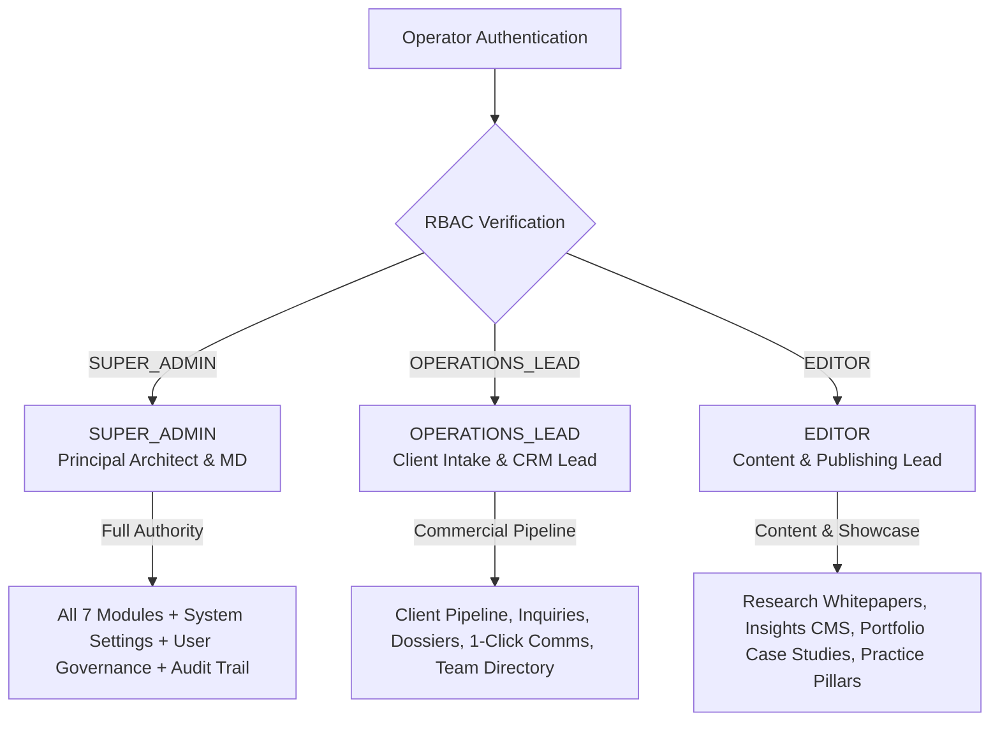

# GERAT MISSION CONTROL // ROLES & PERMISSIONS SPECIFICATION
> **Document Version:** 2.0.0  
> **Status:** Production Architecture Specification  
> **Location:** `progress/roles/ROLES_AND_PERMISSIONS.md` (and mirrored in `docs/progress/roles/ROLES_AND_PERMISSIONS.md`)  
> **Scope:** Consolidated 3-Role Access Control (RBAC), Page Restrictions, Navigation Filtering, API Guards & Task Division for Gerat Software Solutions PLC

---

## 1. Executive Summary & Role Consolidation

To ensure maximum operational efficiency, clear accountability, and streamlined security governance, Gerat Mission Control consolidates all studio operations into **three core roles**:

1. **`SUPER_ADMIN`**: Full root authority across all 7 dashboard modules, operator user governance, site configuration, telemetry, and system audit logs.
2. **`OPERATIONS_LEAD`**: Commercial operations lead for client intake CRM, high-velocity lead triage, client communications (WhatsApp / Email / Calls), proposal scoping, and team directory assignments.
3. **`EDITOR`**: Content & CMS lead for authoring and publishing technical research whitepapers, architecture insights, client portfolio case studies, and practice pillars.

---

## 2. Detailed Role Specifications

### Role 01: `SUPER_ADMIN`
- **Designation:** Principal Architect / Managing Director (Executive Leadership)
- **Standard Seed Account:** `admin@gerat.et`
- **Primary Mission:** Omnipotent studio oversight across executive operations, technical integrity, brand reputation, commercial growth, operator provisioning, and system infrastructure.
- **Core Responsibilities:**
  - Full visibility into all client leads, budgets, commercial agreements, and negotiation stages.
  - Authoring, publishing, and archiving technical research whitepapers and flagship case studies.
  - Managing team roster, practitioner bios, and operator accounts (creating, reassigning roles, resetting passwords, and deactivating accounts).
  - Configuring global studio telemetry, notification webhooks (Telegram/Slack), ticker tokens, and inspecting the immutable audit log.
- **Access Level:** **UNRESTRICTED (All Pages & APIs)**

---

### Role 02: `OPERATIONS_LEAD`
- **Designation:** Client Operations Lead / Business Development Manager
- **Standard Seed Account:** `operations@gerat.et`
- **Primary Mission:** High-velocity lead triage, commercial qualification, client communications, proposal dispatch, and contract closure.
- **Core Responsibilities:**
  - Triaging incoming website inquiries (`NEW_INTAKE`).
  - Engaging prospective clients via 1-click WhatsApp direct, phone calls, and templated architectural emails.
  - Qualifying client budgets (`75K - 150K ETB`, `250K+ ETB Enterprise`) and delivery timelines (`URGENT 2-4 WEEKS`).
  - Logging internal client call notes, meeting summaries, and communication touchpoints.
  - Advancing lead stages (`TRIAGED` → `DISCOVERY_SCHEDULED` → `PROPOSAL_SENT` → `IN_NEGOTIATION` → `COMMISSIONED`).
  - Referencing team practitioner profiles to assign appropriate technical leads.
- **Allowed Pages:**
  - `/dashboard` (Operations Cockpit: Lead Velocity, Inquiries Awaiting Triage, Urgent Inquiries)
  - `/dashboard/inquiries` (Full Kanban & High-Density Data Grid)
  - `/dashboard/inquiries/[id]` (Lead Dossier, Email Composer, Communication Touchpoints, Notes)
  - `/dashboard/team` (Team Directory Reference for client project assignment)
  - `/dashboard/services` (Practice Pillars Reference for proposal deliverable scoping)
- **Strictly Restricted Pages:**
  - ❌ `/dashboard/settings/*` (No access to operator user management, webhooks, API tokens, GPS coordinates, or audit logs)
  - ❌ `/dashboard/insights/*` (Cannot access or edit research whitepapers)
  - ❌ `/dashboard/portfolio/*` (Cannot access or edit case studies)

---

### Role 03: `EDITOR`
- **Designation:** Content Editor / Software Architect / Creative Director
- **Standard Seed Account:** `editor@gerat.et`
- **Primary Mission:** Authoring, curating, and publishing Gerat's intellectual property—deep-tech whitepapers, distributed systems architecture case studies, brand showcase, and practice pillars.
- **Core Responsibilities:**
  - Authoring research articles with split-screen Markdown, math formulas (KaTeX), code blocks, and cover imagery (`/dashboard/insights`).
  - Documenting enterprise case study technical specifications, architecture diagrams, latency metrics, and tech stack tags (`/dashboard/portfolio`).
  - Maintaining Practice Pillars & Service capabilities table matrix (`/dashboard/services`).
- **Allowed Pages:**
  - `/dashboard` (Editorial Cockpit: Draft & Published Articles, Case Studies, Pillar Verification)
  - `/dashboard/insights` + `/dashboard/insights/new` + `/dashboard/insights/[id]` (Full Articles CMS)
  - `/dashboard/portfolio` + `/dashboard/portfolio/new` + `/dashboard/portfolio/[id]` (Full Portfolio CMS)
  - `/dashboard/services` + `/dashboard/services/[id]` (Practice Pillars & Scope)
- **Strictly Restricted Pages:**
  - ❌ `/dashboard/inquiries/*` (Cannot access commercial client leads, phone numbers, budgets, or negotiations)
  - ❌ `/dashboard/settings/*` (Cannot access operator management, system webhooks, or mutation audit logs)
  - ❌ `/dashboard/team/*` (Cannot manage leadership or practitioner accounts)

---

## 3. Comprehensive Page Access Matrix

| Dashboard Route | `SUPER_ADMIN` | `OPERATIONS_LEAD` | `EDITOR` |
| :--- | :---: | :---: | :---: |
| **`/dashboard` (Cockpit Overview)** | Executive Cockpit | Operations Cockpit | Editorial Cockpit |
| **`/dashboard/inquiries` (CRM Grid & Kanban)** | Full Access | Full Access | ⛔ BLOCKED |
| **`/dashboard/inquiries/[id]` (Lead Dossier & Comms)**| Full Access | Full Access | ⛔ BLOCKED |
| **`/dashboard/insights` (Articles List)** | Full Access | ⛔ BLOCKED | Full Access |
| **`/dashboard/insights/new` & `[id]` (Article CMS)** | Full Access | ⛔ BLOCKED | Full Access |
| **`/dashboard/portfolio` (Case Studies List)** | Full Access | ⛔ BLOCKED | Full Access |
| **`/dashboard/portfolio/new` & `[id]` (Portfolio CMS)**| Full Access | ⛔ BLOCKED | Full Access |
| **`/dashboard/team` (Team Roster Directory)** | Full Access (CRUD) | Directory Reference | ⛔ BLOCKED |
| **`/dashboard/team/new` & `[id]` (Member Editor)**| Full Access | ⛔ BLOCKED | ⛔ BLOCKED |
| **`/dashboard/services` (Practice Pillars)** | Full Access | Scope Reference | Full Access |
| **`/dashboard/settings` (Site Config & Users)**| Full Access | ⛔ BLOCKED | ⛔ BLOCKED |
| **`/dashboard/settings/users` (Operator Governance)**| Full Access | ⛔ BLOCKED | ⛔ BLOCKED |
| **`/dashboard/settings/audit-log` (Audit Trail)**| Full Access | ⛔ BLOCKED | ⛔ BLOCKED |

---

## 4. Enforcement Architecture

### 1. Dynamic Sidebar Navigation Filtering (`DashboardSidebar.jsx`)
- Receives authenticated `user.role`.
- Dynamically filters out links to unauthorized modules.
- Shows relevant live count badges (`newInquiries` for Operations Lead).

### 2. Edge Middleware Route Guards (`src/middleware.js`)
- Validates the user's role on every incoming dashboard request.
- Automatically intercepts unauthorized direct navigation and redirects to `/dashboard?unauthorized=true&domain=...`.
- Prevents cross-role access at the edge before server components render.

### 3. API Route Defense-in-Depth
- Every API endpoint (`/api/inquiries/*`, `/api/settings/*`, `/api/articles/*`, `/api/portfolio/*`, `/api/team/*`, `/api/services/*`) validates session cookies via `getCurrentUser()`.
- Enforces strict RBAC checks via `isAuthorized(user.role, allowedRoles)`.
- Unauthorized requests receive HTTP `403 Forbidden` with detailed error telemetry.

### 4. In-Modal Operator Governance UX (`/dashboard/settings/users`)
- Super Admins can provision new operators, reassign roles, reset passphrases, and suspend accounts.
- Validation errors (missing fields, invalid email format, short passphrases, duplicate emails) are displayed directly **inside** the modal card in high-contrast alert boxes.
- Problematic input fields are immediately highlighted with red borders and red backgrounds.
