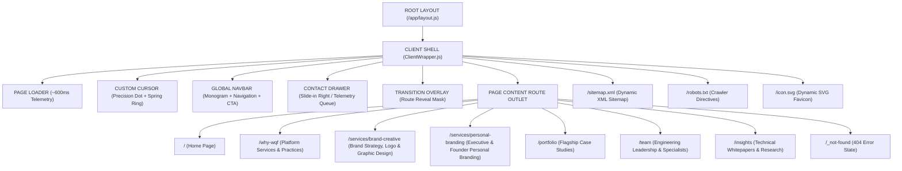

# GERAT SOFTWARE SOLUTIONS PLC // SITE MAP & BRAND SPECIFICATION

> **Document Version:** 1.0.0  
> **Target Production URL:** [https://gerat.et](https://gerat.et)  
> **Repository:** `gerat-website` (Next.js 16.3.4 App Router / Turbopack)  
> **Brand Identity:** Deep-Tech Software Studio // Architecture, Enterprise Systems & AI  

---

## 1. Brand Identity & Logo Assets

The visual identity of **Gerat Software Solutions PLC** is founded on clean architectural geometry, monolithic dark surfaces, and a high-energy technical accent (`#FF4A00`).

### Visual Emblem Construction
The Gerat mark is a structured, rectilinear **G-Monogram** with a distinct cut-away threshold and a high-precision orange accent spark embedded at the operational junction point.

```
┌──────────────────────────────┐
│  ████████████████████████    │
│  ██                          │
│  ██      ████████████████    │
│  ██      ██                  │
│  ██      ██      [ ■ ]       │  <-- #FF4A00 Precision Accent Spark
│  ████████████████████████    │
└──────────────────────────────┘
```

### Brand Color Tokens
| Token | Hex Value | Role | Usage |
| :--- | :--- | :--- | :--- |
| `--bg` | `#050505` | Deep Obsidian Base | Canvas background, air-gapped terminal aesthetic |
| `--surface` | `#141414` | Technical Surface | Cards, modules, input containers, modal sheets |
| `--accent` | `#FF4A00` | High-Energy Orange | Core brand spark, active pills, CTAs, interactive highlights |
| `--text-primary` | `#F0F0F0` | High-Contrast White | Headlines, primary typographic statements |
| `--text-muted` | `#8E8E8E` | Telemetry Grey | Metadata, sub-labels, timestamps, technical specs |
| `--border-subtle` | `rgba(255, 255, 255, 0.08)` | Hairline Divider | Precision grids, corner brackets, column partitions |

### Logo Asset Files
The vector logo assets are organized in both `docs/progress/sitemap/` and public web directory `public/brand/`:

- **Standalone Monogram Vector:** [`gerat-monogram.svg`](file:///home/dawit/Documents/Projects/Ger%C3%A4t/Ger%C3%A4t/docs/progress/sitemap/gerat-monogram.svg)  
  *Served live at:* `/brand/gerat-monogram.svg`
- **Full Horizontal Brand Lockup:** [`gerat-logo-full.svg`](file:///home/dawit/Documents/Projects/Ger%C3%A4t/Ger%C3%A4t/docs/progress/sitemap/gerat-logo-full.svg)  
  *Served live at:* `/brand/gerat-logo-full.svg`
- **Application Favicon / Tab Icon:** [`icon.svg`](file:///home/dawit/Documents/Projects/Ger%C3%A4t/Ger%C3%A4t/src/app/icon.svg)  
  *Served live at:* `/icon.svg`

---

## 2. Master Route Hierarchy



---

## 3. Detailed Route Matrix

| Route Path | Page Title | Rendering Strategy | Core Content / Purpose | Primary CTA |
| :--- | :--- | :--- | :--- | :--- |
| **`/`** | Gerat Software Solutions PLC \| Deep-Tech Software & Digital Systems | Static Pre-rendered (`○`) | Master editorial narrative: Hero 3D particles, continuous marquee, core ethos, 8-row capabilities table, 3 featured case studies, Brand & Creative section, 6-stage methodology, leadership preview, and technology ecosystem. | `START A PROJECT` & `EXPLORE WORK` |
| **`/why-wqf`** | Platform & Engineering Services \| Gerat | Static Pre-rendered (`○`) | 6 core practice pillars: Enterprise Architecture, AI & RAG, Custom ERP, Public Sector, Brand Strategy & Identity Systems, and Executive Personal Branding. | `INITIATE PROJECT` |
| **`/services/brand-creative`** | Brand Strategy, Logo Design & Creative Systems \| Gerat | Static Pre-rendered (`○`) | Dedicated brand & design service page: 6 creative disciplines, vector production formats (SVG, EPS, PDF, Print, Web), strategic packages, and FAQs. | `COMMISSION BRAND WORK` |
| **`/services/personal-branding`** | Executive & Founder Personal Branding \| Gerat | Static Pre-rendered (`○`) | Dedicated personal branding page: 7-pillar executive framework, target leader personas, personal website architecture, and strategy consultation. | `BOOK BRAND CONSULTATION` |
| **`/portfolio`** | Selected Architectural Works \| Gerat | Static Pre-rendered (`○`) | Interactive case study showcase with category filtering (`ALL`, `BRAND & IDENTITY`, `PERSONAL BRAND`, `ENTERPRISE ERP`, `PUBLIC SECTOR`, `AI & RAG`) and sticky directory. | `COMMISSION SIMILAR ARCHITECTURE` |
| **`/team`** | Engineering Leadership & Team \| Gerat | Static Pre-rendered (`○`) | Profiles of Executive Architects, Specialized Engineering Practitioners (DevOps, Security, Distributed Systems, Interaction), and team engineering principles. | `JOIN ENGINEERING` |
| **`/insights`** | Technical Insights & Whitepapers \| Gerat | Static Pre-rendered (`○`) | 9 deep-tech research publications covering distributed consensus, RAG, telemetry, brand systems, and executive positioning. | `SUBSCRIBE / CONTACT` |
| **`/sitemap.xml`** | Dynamic XML Sitemap | Route Handler (`○`) | Automated index for search engine crawlers with priority weighting and change frequencies. | N/A |
| **`/robots.txt`** | Crawler Directives | Route Handler (`○`) | Allows full site indexing with canonical link to `/sitemap.xml`. | N/A |
| **`/icon.svg`** | SVG Application Icon | Route Handler (`○`) | High-resolution scalable browser favicon and mobile bookmark icon. | N/A |

---

## 4. Component & Content Mapping

Each route consumes centralized, single-source-of-truth data objects from [`src/content/`](file:///home/dawit/Documents/Projects/Ger%C3%A4t/Ger%C3%A4t/src/content):

```text
src/content/
├── site.js          --> Global company metadata, telemetry coordinates, nav links, social channels
├── portfolio.js     --> 6 detailed case study objects (National Records, Axiom ERP, Synapse RAG, etc.)
├── team.js          --> Executive leadership profiles & specialized practitioner roster
├── services.js      --> 4 core practice pillars & 6-row architectural capabilities table
├── insights.js      --> 6 technical whitepapers with dates, authors, tags, and reading times
├── ethos.js         --> 4 core operational values & 6-step engineering methodology
└── index.js         --> Master central exporter
```

### Route-to-Component Breakdown

#### 1. Home Route (`/`)
- `components/three/HeroDataField.jsx` (5,500 interactive WebGL/Canvas particles)
- `components/home/Hero.jsx` (Asymmetric title, mission statement, magnetic CTAs)
- `components/home/Marquee.jsx` (Continuous technical capabilities ticker)
- `components/home/OurEthos.jsx` (Expanding value accordion with custom SVG iconography)
- `components/home/OurFocus.jsx` (Interactive 8-row capabilities table)
- `components/home/OurPortfolio.jsx` (3 flagship case studies with corner accents)
- `components/home/BrandCreativeSection.jsx` (4 monolithic creative cards + direct booking)
- `components/home/HowWeWork.jsx` (6-step engineering methodology)
- `components/home/OurLeadership.jsx` (Executive preview grid)
- `components/home/Partners.jsx` (Technology infrastructure partner matrix)
- `components/layout/Footer.jsx` (Large editorial CTA + colophon + legal)

#### 2. Platform Services Route (`/why-wqf`)
- `app/why-wqf/components/ServicesOverview.jsx`
  - Section 01: Enterprise Cloud Platforms & Core ERP
  - Section 02: Domain-Grounded AI & Enterprise RAG Systems
  - Section 03: Distributed Telemetry & Industrial IoT
  - Section 04: Public Sector & Civic Registry Infrastructure
  - Section 05: Brand Strategy, Identity & Design Systems
  - Section 06: Executive & Founder Personal Branding
- `components/layout/Footer.jsx`

#### 2b. Brand Strategy & Creative Systems Route (`/services/brand-creative`)
- `app/services/brand-creative/page.js`
  - 6 Creative Disciplines: Strategy, Logo Systems, Visual Identity, Graphic Design, Social Systems, Production Formats
  - Production Deliverables & Vector Matrix (SVG, EPS, PDF, Print, Web)
  - Reassurance FAQs & Strategic Packages
- `components/layout/Footer.jsx`

#### 2c. Executive & Personal Branding Route (`/services/personal-branding`)
- `app/services/personal-branding/page.js`
  - 7-Pillar Executive Framework: Positioning, Visual Identity, Photography Direction, LinkedIn Branding, Executive Website, Content Direction, Launch Rollout
  - Target Leader Personas (Founders, Executives, Consultants, Tech Leaders)
  - Case Study Spotlight (`meridian-executive`)
- `components/layout/Footer.jsx`

#### 3. Portfolio Route (`/portfolio`)
- `app/portfolio/components/Hero.jsx` (Discipline filter tabs)
- `app/portfolio/components/PortfolioShowcase.jsx` (Sticky navigation directory + 6 deep-dive case studies)
- `components/layout/Footer.jsx`

#### 4. Team Route (`/team`)
- `app/team/components/TeamHero.jsx` (Hero statement & headcount telemetry)
- `app/team/components/TeamLeadership.jsx` (Executive director cards with focus metrics)
- `app/team/components/AdvisorAndTeam.jsx` (Engineering practitioners grid)
- `app/team/components/TeamEthos.jsx` (Core engineering principles)
- `components/layout/Footer.jsx`

#### 5. Insights Route (`/insights`)
- `app/insights/components/InsightsHero.jsx` (Research laboratory mission & filter tabs)
- `app/insights/components/LatestNews.jsx` (Featured flagship paper + technical article grid)
- `components/layout/Footer.jsx`

---

## 5. Global Shell Architecture & Interactive Layers

1. **Brand Telemetry Loader (`PageLoader.jsx`):**
   - Renders a ~600ms deterministic loading sequence during first visit per session.
   - Automatically skipped if `sessionStorage.getItem("gerat_loaded")` is set or under `prefers-reduced-motion`.
2. **Global Navigation (`Navbar.jsx`):**
   - Features scroll compression (transforms from full-width border to compact floating pill capsule after 40px scroll).
   - Hides on scroll-down past first viewport, reveals instantly on scroll-up.
   - Includes full-screen mobile menu with diagonal clip-path entrance.
3. **Contact Inquiry Drawer (`ContactDrawer.jsx`):**
   - Slides from right edge (`x: 100% -> 0`) with dark backdrop blur.
   - Accessible via global state (`useNav()`) from buttons across all pages.
   - Contains discipline selector pills, delivery timeline options, and a simulated telemetry intake confirmation pipeline (`GRT-XXXXXX`).
4. **Adaptive Custom Cursor (`CustomCursor.jsx`):**
   - Precision center dot locked to mouse pointer coordinates.
   - Spring-interpolated trailing ring with dynamic scaling on interactive targets.
   - Contextual micro-labels (`INQUIRE`, `EXPLORE`, `VIEW`, `CONTACT`).
   - Automatically disabled on touch screens (`pointer: coarse`) and under `prefers-reduced-motion: reduce`.
5. **Magnetic Physics (`Magnetic.jsx`):**
   - Clamped spring attraction (8–10px maximum displacement) on primary CTA buttons.
6. **Route Transition Mask (`TransitionOverlay.jsx`):**
   - Smooth curtain wipe between route changes powered by `PageTransitionContext`.

---

## 6. Verification Status

- **Automated Smoke Tests:** 4/4 suites passing (Design Tokens, Components, Routes, Anti-Legacy Rules).
- **Runtime Dev Server Tests:** All 5 primary pages return `200 OK` with zero ReferenceErrors.
- **ESLint Health:** 0 errors across the entire codebase (`no-undef` strictly enforced).
- **Production Build:** Next.js 16.3.4 Turbopack pre-renders all 11 static routes in ~1.4 seconds.
