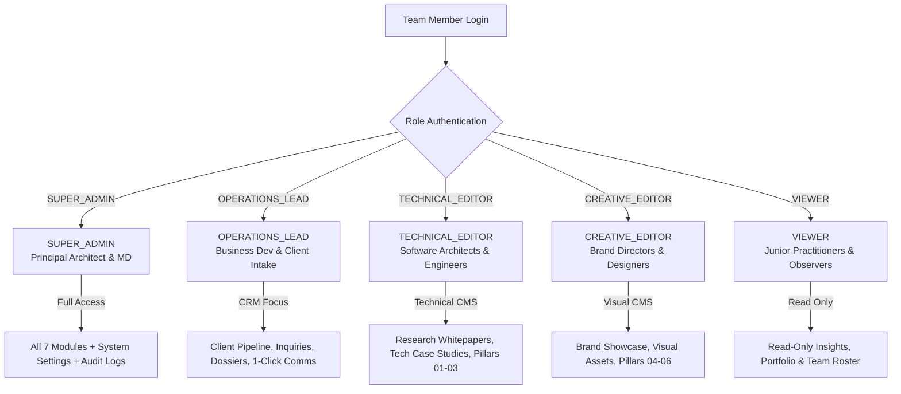

# GERAT MISSION CONTROL // ROLES & PERMISSIONS SPECIFICATION
> **Document Version:** 1.0.0  
> **Status:** Production Architecture Specification  
> **Location:** `progress/roles/ROLES_AND_PERMISSIONS.md` (and mirrored in `docs/progress/roles/ROLES_AND_PERMISSIONS.md`)  
> **Scope:** Role-Based Access Control (RBAC), Page Restrictions, Navigation Filtering, API Guards & Task Division for Gerat Software Solutions PLC

---

## 1. Executive Summary & Problem Statement

Currently, all administrative team members accessing the dashboard (`/dashboard`) see the identical sidebar navigation links, the identical overview widgets, and have unrestricted access to all pages. 

In a high-performing engineering and creative studio, the fundamental purpose of **Role-Based Access Control (RBAC)** is to:
1. **Enforce Security & Privacy:** Prevent non-executive team members from accessing sensitive commercial intake data (client budgets, negotiation notes, direct phone numbers) or modifying system infrastructure settings (notification webhooks, API tokens, audit logs).
2. **Eliminate Cognitive Overload & Confusion:** An engineer writing technical whitepapers should not be distracted by CRM deal pipelines; a business development lead should not be navigating through raw markdown blog editors or case study tech stacks.
3. **Establish Clear Task Ownership & Accountability:** Every role has a distinct responsibility boundary, a tailored operational cockpit, and strictly enforced page permissions.

---

## 2. Core Studio Roles & Operational Responsibilities

---

### Role 01: `SUPER_ADMIN`
- **Official Title:** Principal Architect / Managing Director (Executive Leadership)
- **Primary Mission:** Omnipotent studio oversight across executive operations, technical integrity, brand reputation, commercial growth, and system infrastructure.
- **Core Responsibilities:**
  - Full visibility into all client leads, budgets, commercial agreements, and negotiation stages.
  - Publishing and approving flagship case studies, technical whitepapers, and practice pillars.
  - Managing team roster, practitioner bios, roles, and administrative user credentials.
  - Configuring global studio telemetry, notification webhooks (Telegram/Slack), ticker tokens, and inspecting the immutable audit log.
- **Access Level:** **UNRESTRICTED (All Pages & APIs)**

---

### Role 02: `OPERATIONS_LEAD`
- **Official Title:** Client Operations Lead / Business Development Manager
- **Primary Mission:** High-velocity lead triage, commercial qualification, client communications, proposal dispatch, and contract closure.
- **Core Responsibilities:**
  - Triaging incoming website inquiries (`NEW_INTAKE`).
  - Engaging prospective clients via 1-click WhatsApp direct, phone calls, and templated architectural emails.
  - Qualifying client budgets (`75K - 150K ETB`, `250K+ ETB Enterprise`) and delivery timelines (`URGENT 2-4 WEEKS`).
  - Logging internal client call notes, meeting summaries, and communication touchpoints.
  - Advancing lead stages (`TRIAGED` → `DISCOVERY_SCHEDULED` → `PROPOSAL_SENT` → `IN_NEGOTIATION` → `COMMISSIONED`).
  - Referencing team practitioner profiles to assign appropriate technical leads.
- **Allowed Pages:**
  - `/dashboard` (Operations Cockpit: Lead Velocity, Inquiries Awaiting Triage, Urgent Inquiries)
  - `/dashboard/inquiries` (Full Kanban & High-Density Data Grid)
  - `/dashboard/inquiries/[id]` (Lead Dossier, Email Composer, Communication Touchpoints, Notes)
  - `/dashboard/team` (Read-Only Practitioner Directory for assignment matching)
  - `/dashboard/services` (Read-Only Practice Pillars for scoping proposal deliverables)
- **Strictly Restricted Pages:**
  - ❌ `/dashboard/settings/*` (No access to webhooks, API tokens, GPS coordinates, or audit logs)
  - ❌ `/dashboard/insights/new`, `[id]` (Cannot author or edit technical whitepapers)
  - ❌ `/dashboard/portfolio/new`, `[id]` (Cannot edit case study architecture specs)
  - ❌ `/dashboard/team/new`, `[id]` (Cannot create, edit, or delete team member accounts)

---

### Role 03: `TECHNICAL_EDITOR`
- **Official Title:** Lead Software Architect / Senior Engineering Practitioner
- **Primary Mission:** Authoring and maintaining technical depth—deep-tech whitepapers, distributed systems architecture case studies, and engineering capabilities.
- **Core Responsibilities:**
  - Authoring research articles with split-screen Markdown, math formulas (KaTeX), and code blocks (`/dashboard/insights`).
  - Documenting enterprise case study technical specifications, architecture diagrams, latency metrics, and tech stacks (`/dashboard/portfolio`).
  - Maintaining Practice Pillars 01–03 (Cloud & Enterprise Systems, High-Concurrency AI, Distributed Data).
- **Allowed Pages:**
  - `/dashboard` (Engineering Cockpit: Draft & Published Whitepapers, Tech Case Studies, Metric Verification)
  - `/dashboard/insights` + `/dashboard/insights/new` + `/dashboard/insights/[id]` (Full CMS)
  - `/dashboard/portfolio` + `/dashboard/portfolio/new` + `/dashboard/portfolio/[id]` (Full CMS)
  - `/dashboard/services` + `/dashboard/services/[id]` (Technical Pillars 01–03)
- **Strictly Restricted Pages:**
  - ❌ `/dashboard/inquiries/*` (Cannot access commercial client leads, phone numbers, budgets, or negotiations)
  - ❌ `/dashboard/settings/*` (Cannot access system webhooks or mutation audit logs)
  - ❌ `/dashboard/team/new`, `[id]` (Cannot manage HR/team member accounts)

---

### Role 04: `CREATIVE_EDITOR`
- **Official Title:** Executive Creative Director / Brand Strategy Lead
- **Primary Mission:** Curating Gerat's visual identity, brand strategy case studies, personal branding services, and design showcase.
- **Core Responsibilities:**
  - Authoring brand strategy, design systems, and creative direction case studies (`/dashboard/portfolio`).
  - Managing homepage featured showcase state and visual deliverable galleries.
  - Authoring design ethos, typography, and creative strategy insights (`/dashboard/insights`).
  - Maintaining Practice Pillars 04–06 (Brand Architecture, Design Token Systems, Executive Advisory).
- **Allowed Pages:**
  - `/dashboard` (Creative Cockpit: Brand Showcase Curation, Featured Case Studies, Visual Publications)
  - `/dashboard/portfolio` + `/dashboard/portfolio/new` + `/dashboard/portfolio/[id]` (Full CMS)
  - `/dashboard/insights` + `/dashboard/insights/new` + `/dashboard/insights/[id]` (Brand & Design categories)
  - `/dashboard/services` + `/dashboard/services/[id]` (Creative Pillars 04–06)
- **Strictly Restricted Pages:**
  - ❌ `/dashboard/inquiries/*` (Cannot access client commercial intake or contact vectors)
  - ❌ `/dashboard/settings/*` (Cannot access system webhooks or audit trails)
  - ❌ `/dashboard/team/new`, `[id]` (Cannot manage team roster)

---

### Role 05: `VIEWER`
- **Official Title:** Internal Observer / Junior Practitioner / External Auditor
- **Primary Mission:** Internal visibility into studio operations, published works, and team roster without mutation authority.
- **Core Responsibilities:**
  - Reviewing published technical whitepapers and case studies.
  - Viewing the active team roster and practice pillars.
- **Allowed Pages:**
  - `/dashboard` (Read-only Studio Overview)
  - `/dashboard/insights` (Read-only published article list)
  - `/dashboard/portfolio` (Read-only published case study list)
  - `/dashboard/team` (Read-only team directory)
  - `/dashboard/services` (Read-only practice pillars)
- **Strictly Restricted Pages:**
  - ❌ `/dashboard/inquiries/*` (No access to client leads)
  - ❌ `/dashboard/settings/*` (No access to settings or audit logs)
  - ❌ All `/new` creation routes (`/insights/new`, `/portfolio/new`, `/team/new`, `/services/new`)
  - ❌ All edit and delete capabilities (mutation buttons hidden/disabled)

---

## 3. Comprehensive Page Access Matrix

| Dashboard Route | `SUPER_ADMIN` | `OPERATIONS_LEAD` | `TECHNICAL_EDITOR` | `CREATIVE_EDITOR` | `VIEWER` |
| :--- | :---: | :---: | :---: | :---: | :---: |
| **`/dashboard` (Cockpit Overview)** | Full Cockpit | Ops Cockpit | Tech Cockpit | Creative Cockpit | Read-Only |
| **`/dashboard/inquiries` (CRM Grid & Kanban)** | Full Access | Full Access | ⛔ BLOCKED | ⛔ BLOCKED | ⛔ BLOCKED |
| **`/dashboard/inquiries/[id]` (Lead Dossier & Comms)**| Full Access | Full Access | ⛔ BLOCKED | ⛔ BLOCKED | ⛔ BLOCKED |
| **`/dashboard/insights` (Articles List)** | Full Access | ⛔ BLOCKED | Full Access | Full Access | Read-Only |
| **`/dashboard/insights/new` & `[id]` (Editor)** | Full Access | ⛔ BLOCKED | Full Access | Full Access | ⛔ BLOCKED |
| **`/dashboard/portfolio` (Case Studies List)** | Full Access | ⛔ BLOCKED | Full Access | Full Access | Read-Only |
| **`/dashboard/portfolio/new` & `[id]` (Editor)**| Full Access | ⛔ BLOCKED | Full Access | Full Access | ⛔ BLOCKED |
| **`/dashboard/team` (Team Roster Directory)** | Full Access | Read-Only (Ref) | ⛔ BLOCKED | ⛔ BLOCKED | Read-Only |
| **`/dashboard/team/new` & `[id]` (Member Editor)**| Full Access | ⛔ BLOCKED | ⛔ BLOCKED | ⛔ BLOCKED | ⛔ BLOCKED |
| **`/dashboard/services` (Practice Pillars)** | Full Access | Read-Only (Ref) | Full Access (01-03)| Full Access (04-06)| Read-Only |
| **`/dashboard/settings` (Site Config & Coordinates)**| Full Access | ⛔ BLOCKED | ⛔ BLOCKED | ⛔ BLOCKED | ⛔ BLOCKED |
| **`/dashboard/settings/audit-log` (Audit Trail)**| Full Access | ⛔ BLOCKED | ⛔ BLOCKED | ⛔ BLOCKED | ⛔ BLOCKED |
| **`/dashboard/settings/site-config` (Raw Config)**| Full Access | ⛔ BLOCKED | ⛔ BLOCKED | ⛔ BLOCKED | ⛔ BLOCKED |

---

## 4. Enforcement Architecture

### 1. Dynamic Sidebar Navigation Filtering
- `DashboardSidebar.jsx` receives the authenticated `user.role`.
- Navigation items are filtered dynamically so restricted pages do not appear in the menu.
- Role-specific badge indicators:
  - `OPERATIONS_LEAD`: Receives `newInquiries` count badge.
  - `TECHNICAL_EDITOR` & `CREATIVE_EDITOR`: Receives `draftArticles` / `draftProjects` badge.

### 2. Edge Middleware & Route Guards (`src/middleware.js`)
- If an authenticated user attempts to type or navigate directly to an unauthorized URL (e.g. `OPERATIONS_LEAD` visiting `/dashboard/settings` or `TECHNICAL_EDITOR` visiting `/dashboard/inquiries`):
  - Middleware immediately halts the request and redirects to `/dashboard?unauthorized=true`.
  - A high-visibility security alert displays: *"Access Restricted: Your role does not possess clearance for this operational domain."*

### 3. API Route Defense-in-Depth
- Every API endpoint (`/api/inquiries/*`, `/api/settings/*`, `/api/team/*`, `/api/articles/*`, `/api/portfolio/*`) validates `getCurrentUser()` and enforces `isAuthorized(user.role, allowedRoles)`.
- If unauthorized, returns HTTP `403 Forbidden` with `{ success: false, error: "INSUFFICIENT_PERMISSIONS" }`.

### 4. Role-Tailored Cockpit Overviews (`/dashboard`)
The main overview dashboard adapts to the authenticated role:
- **`SUPER_ADMIN`:** Full studio KPI grid (All Inquiries, Portfolio Works, Research Insights, Engineering Roster, Marquee Ticker, Audit Activity).
- **`OPERATIONS_LEAD`:** Intake Velocity, Urgent Leads, Awaiting Triage, 1-Click WhatsApp Shortcuts, Recent Lead Dossiers.
- **`TECHNICAL_EDITOR`:** Published Whitepapers, Drafts in Progress, Active Engineering Case Studies, Code Snippets.
- **`CREATIVE_EDITOR`:** Brand Identity Projects, Showcase Featured States, Design System Deliverables.
- **`VIEWER`:** Studio Activity Overview with read-only statistics.
